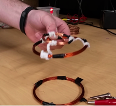

# Wireless Power Transfer via SCMR for Embedded Systems

## Preface
This was a project built in Fall 2014 for a graduate course in Embedded Systems at [UC Davis](http://www.ece.ucdavis.edu). We built a system for wireless power transfer via Strongly-Coupled Magnetic Resonance (SCMR). We also developed a [Matlab program](SCMR.m) to calculate the resonant frequency to within 10% for the design in the photo. It's worth noting that this was a different type of project, and was proposed and set out on by two students with very little background on the subject-matter. If you've never had an opportunity to view mid-range wireless power transfer via SCMR, I encourage you to repeat our experiment, as one word comes to mind when observed in person.

## [Abstract](SCMR4EmbdSys.pdf)
We briefly review the methods behind mid-range wireless power transfer using Strongly Coupled Magnetic Resonance (SCMR) to power embedded systems applications. From these reviewed methods, we then develop a mathematical model for SCMR to calculate resonant frequencies and other electrical characteristics for a given coil in MATLAB. The results from the model are verified experimentally through the implementation of several design iterations. The MATLAB model is accurate to within 10% of the experimental values for Design III. We also discuss the optimal design for maximum wireless power transfer and the constraints associated. Previous work shows wireless power transfer over 2 meters at about 40% efficiency with 60cm diameter resonating coils. We present a significantly scaled down design (Design III) with wireless power transfer via SCMR over 10cm using 8.25cm diameter coils, roughly 7.5 times smaller. The smaller design makes an excellent choice for powering small scale embedded systems applications.

Notes: This document needs to be updated to remove outdated contact info and a broken link to a domain no longer managed by the authors. 

## Experimental Refresh
The two SCMR coils in the photo atop consist of 7 turns of 17 AWG wire with a diameter of 3.25 inches, along with an additional single-loop coil, fastened together with electric tape. The transmitting coil is being driven via induction through the single loop coil, which is attached to a function generator. An amplifier can be designed to provide enough gain to wirelessly power a low-energy microprocessor (or charge a battery, etc). See the [PDF](SCMR4EmbdSys.pdf) for additional info on the system (Design III).  

In addition to the materials mentioned, some aerosol adhesive is useful to maintain the larger coils' shape, as minute changes alter the capacitances and resulting resonant frequencies. Sandpaper is also useful to remove the insulating coating from the wire ends. Also note the lead capacitances of the driver (alligator clips) affect the transmitting coil's resonant frequency - the receiving coil's design should be altered accordingly (offset with an equivalent capacitance) if necessary. The single-loop coil fastened with the receiving coil goes unused, but is still included to aid in matching the coils to one another. 

To measure the resonant frequency of a coil, attach the function generator to the ends of the single loop coil, and oscilloscope leads to the ends of the 7 turn coil. Slowly increase the frequency on the generator and observe the frequency that peaks on the oscilloscope. When performed correctly, the peaks of waveform should be cutoff, as they will be beyond the scale that most standard testbench oscilloscopes can display. Again, note that resonant frequency measured will differ from the true frequency, as this is a result of the added capacitance from the oscilloscope leads. 

2017 Photo Update upcoming ...

## Acknowledgements
- Waqas Haque: Project partner, for transforming what we learned into a form that fit the course material.
- Michael Sitclaru: For independent thinking and ultimately leading us to the best solution.
- [Soheil Ghiasi](http://www.ece.ucdavis.edu/~soheil/): For allowing us the opportunity to try something different in his class.
- [Leo Liu + DART group](https://faculty.engineering.ucdavis.edu/liu/): For allowing us to experiment with a high-frequency function generator.
- [Raj Amirtharajah](http://www.ece.ucdavis.edu/~ramirtha/promotion/amirtharajah_record.html): For encouragement.

### License & Citation
This repository is released under the [BSD 2-Clause license](LICENSE).  
Please [cite](Citation.md) this work if it helps your project / research.
